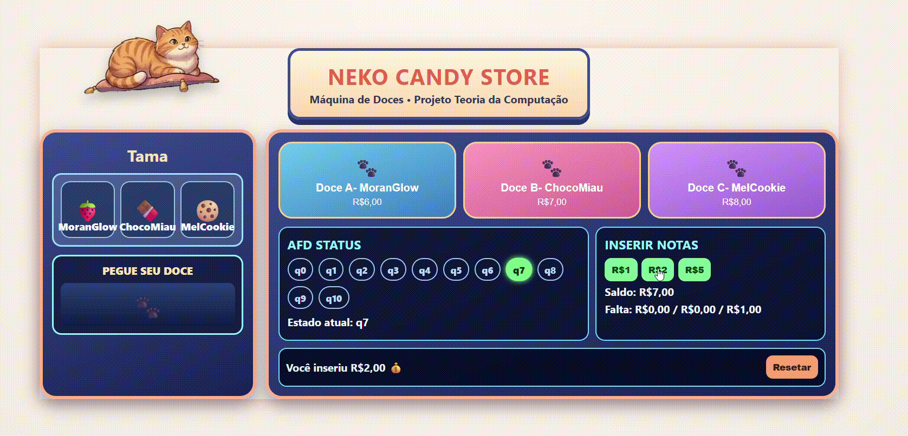

# 🍬🐾 Máquina de Doces - Simulação AFD


---

## Integrantes
👥 Integrantes
Breno Henrique Ruiz dos Santos — 823131791

Maria Eduarda Medeiro Porto — 824144948

Matheus Alves Santana — 824144952


## 🎥 Demonstração



---

## 🎮 Sobre o Projeto

Simulação interativa de uma máquina de doces desenvolvida em **HTML, CSS e JavaScript**, baseada em um **Autômato Finito Determinístico (AFD)**.

O sistema simula:

- Inserção de dinheiro
- Transição de estados
- Liberação de produtos
- Cálculo de troco
- Feedback visual e sonoro

---

## ⚙️ Regras da Máquina

- 💰 Valores aceitos: **R$ 1,00 | R$ 2,00 | R$ 5,00**
- 🚫 Valor máximo permitido: **R$ 10,00**

### 🍭 Doces disponíveis:

| Código | Nome        | Preço |
|--------|------------|------|
| A      | Moranglow  | R$ 6,00 |
| B      | ChocoMiau  | R$ 7,00 |
| C      | MelCookie  | R$ 8,00 |

---

## 🎯 Resultados Possíveis

| Doce | Sem troco | Com troco |
|------|----------|----------|
| A    | ✓        | ✓        |
| B    | ✓        | ✓        |
| C    | ✓        | ✓        |

---

## 🧠 Estrutura do AFD

- **Estados:** `q0` até `q10`
- **Estado inicial:** `q0`
- **Alfabeto:** `{1, 2, 5}`
- **Função de transição:**  
  `δ(qx, valor) → q(x + valor)`

### 🚫 Regra de limite:
Se ultrapassar **R$10**, a máquina bloqueia a operação.

---

## 🔄 Funcionamento
q0 → q1 → q3 → q8

Estados de compra:

- `q6` → pode comprar A  
- `q7` → pode comprar A e B  
- `q8+` → pode comprar todos  

Após a compra:
- Volta para `q0`

---

## 🚀 Como Executar

```bash
- git clone https://github.com/mariamempor/teoria_computacional_compiladores.git
- cd teoria_computacional_compiladores
- git checkout feature-maquina-doces
- index.html
- botão direito do mouse: "open with live server"

---

## 🕹️ Como Usar

### 💰 Inserir dinheiro
Clique nos botões:
- R$1
- R$2
- R$5

---

### 🍬 Escolher doce
- Os botões são ativados automaticamente quando o saldo é suficiente
- Cada botão representa um doce disponível

---

### 🎁 Receber produto
- O doce é liberado na área de saída
- O troco (se houver) é exibido
- Sons e animações são executados automaticamente

---

## Estrutura do Projeto
teoria_computacional_compiladores/
├── index.html
├── style.css
├── script.js
├── assets/
│   ├── coin.mp3
│   ├── dispense.mp3
│   ├── error.mp3
│   ├── cat-top.png
│   ├── paw.png
│   └── demo.gif
└── README.md
